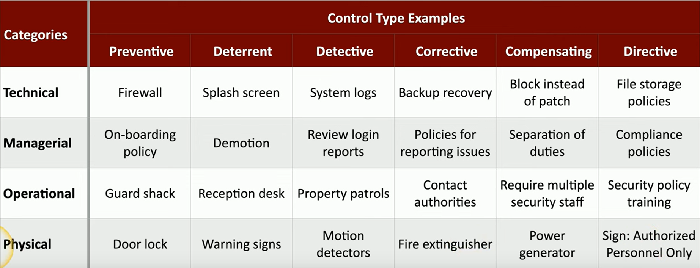

Full objective: "Compare and contrast various types of security controls."

### Security controls
- Various security risks exist for varied assets (data, physical property, computer systems)
- If we recognize security controls, we can prevent events, minimize impact, and limit damage
- Categories:
	- Technical controls
		- Implemented using systems
		- Operating system controls
		- Firewalls, anti-virus
	- Managerial controls
		- Administrative controls, design and implementation
		- Security policies and procedures
	- Operational controls
		- Implemented by people
		- Guards, awareness programs
	- Physical controls
		- Limit physical access
		- Guard shack, fences, locks, badges
- Control types:
	- Preventive: block access to a resource
	- Deterrent: discourage an intrusion attempt
	- Detective: identify and log an intrusion attempt
	- Corrective: applied after an event is detected, reversing impact
	- Compensating: existing controls insufficient, temporarily control using other means
	- Directive: direct a subject towards a compliance (weak, based on suggestion/policy)
- 

Next: [1.2 Fundamental Security Concepts](https://github.com/lercc46/Messer-Sec-Plus-Notes/blob/main/1.0%20General%20Security%20Concepts/1.2%20Fundamental%20Security%20Concepts.md)
