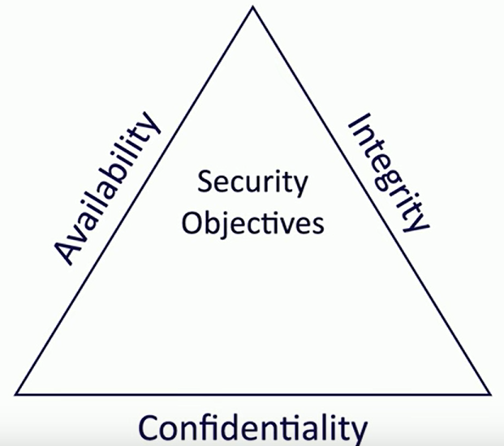
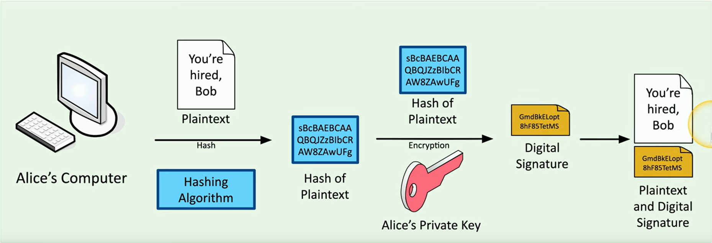
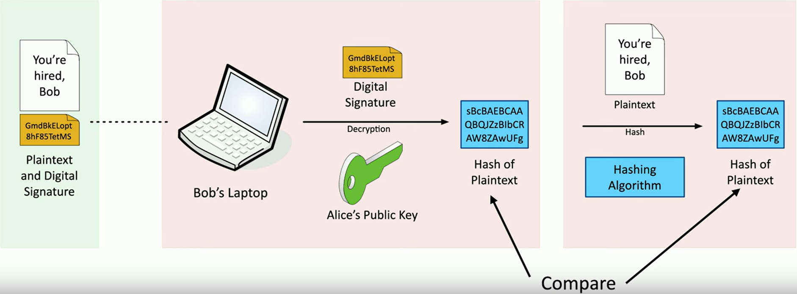
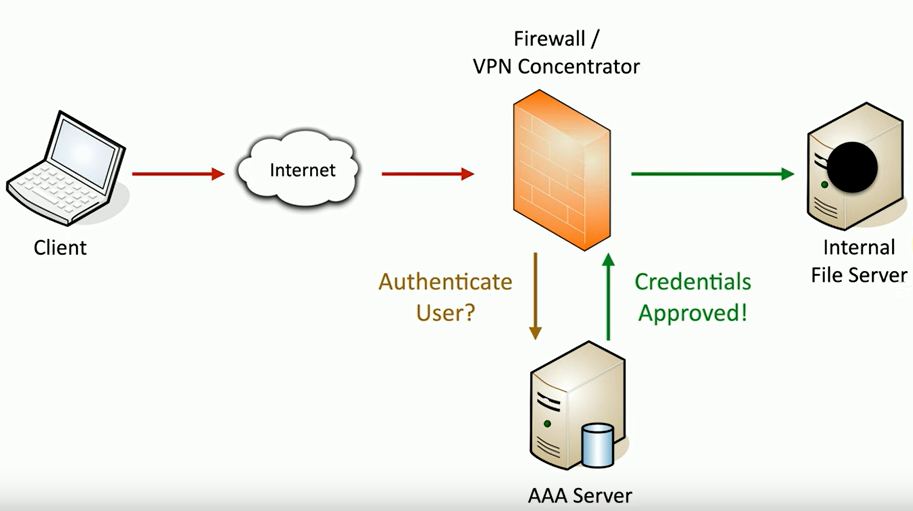
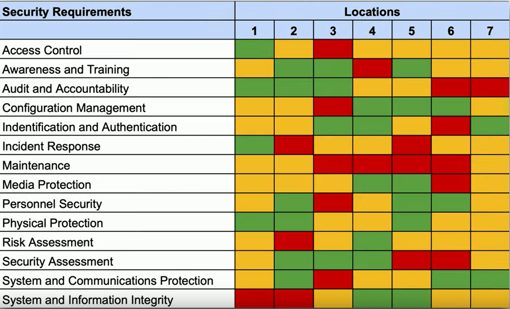
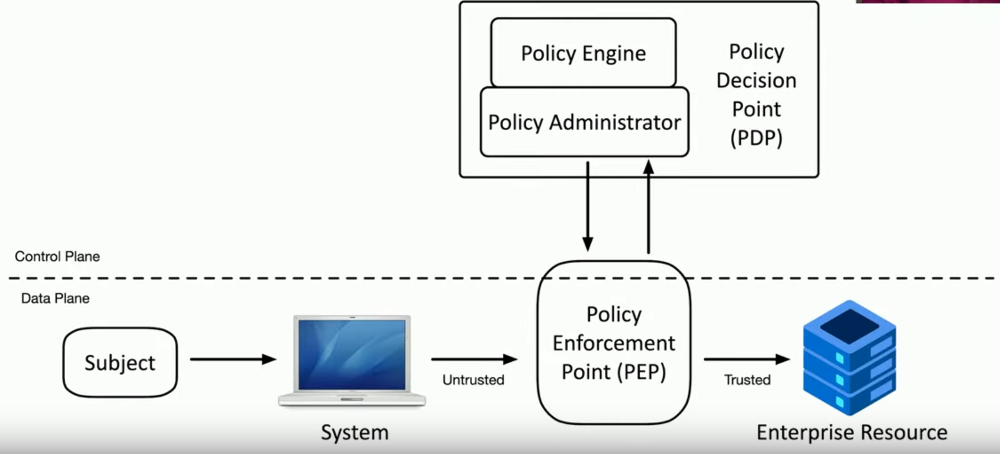

Full objective: "Summarize fundamental security concepts."

### The CIA Triad
- Combination of principles, the fundamentals of security (not to be confused with the Central Intelligence Agency)
- **C - Confidentiality**: prevent disclosure of info to those unauthorized
- **I - Integrity**: information cannot be modified without detection
- **A - Availability**: systems and networks must be up and running
- 
- Confidentiality
	- Certain info should only be known to certain people
	- Encryption, access controls
- Integrity
	- Data is stored and transferred as intended
	- Hashing, digital signatures, certificates, non-repudiation
- Availability
	- Info accessible to authorized used
	- Redundancy, fault tolerance, patching

### Non-repudiation
- You cannot deny what you've said, like signing a digital contract
- Proof of integrity
	- Verify data remains accurate and consistent
	- Can be attained using a hash, data as a short string of text
		- If data changes at all, "fingerprint" changes entirely
	- However... this doesn't associate data with an individual
- Proof of origin
	- Proving the source of the message (authentication)
	- Sign with digital "private key" (only known by sender of data)
		- Verified with "public key"
- Creating a digital signature
	- 
	- 

### Authentication, Authorization, and Accounting
- AAA framework
	- Identification: who you claim to be
	- **Authentication**: prove you are who you claim to be
	- **Authorization**: what access do you have when authorized
	- **Accounting**: what resources did you use when authorized
- Authenticating people 
- Authenticating systems
	- Many managed devices, how to authenticate without a user?
	- Device certificate, VPN or software validates authorized system
- Certificate authentication
	- Organization has a trusted **Certificate Authority (CA)** that signs all device certificated
- Authorization models
	- Certain users and services have access to certain data and applications
	- Put the auth model in the middle
	- Without a model, you would need to profile dozens of users individually
	- With a model, you add abstractions (groups) to reduce complexity

### Gap Analysis
- Where you are compared with where you want to be, requires extensive research
- Choosing the framework
	- Work towards a known baseline and determine the end goal
	- Following a framework like NIST SP 800-171 Revision 2 or ISO/IEC 27001
- Evaluate people and processes
	- Get a baseline of employees: experience, training, knowledge
	- Examine the current processes: systems and policies
- Analysis: compare and contrast
	- Compare, identify weaknesses, then detailed analysis
- The analysis and report
	- Report includes final comparison of objectives and current state as well as path to goal
	- 

### Zero Trust
- Many networks are open on the inside, zero trust says everything must be verified and secured at every step (security in depth)
- Planes of operation
	- Split the network into "functional planes"
	- Data plane: frames, packets, network data
	- Control plane: manage actions of data plane (policies, rules, etc.)
- Controlling trust
	- Adaptive identity
		- Consider source and requested resources, multiple risk indicators, make auth stronger
	- Threat scope reduction: reduce number of entry points
	- Policy-driven access control: combine adaptive identity with rules
- Security zones
	- Broad categorization of where a user is connecting from and where you are going
	- Trusted vs. untrusted, internal vs. external, departments, etc.
	- Zones may be enough to deny access or provide implicit trust
- Policy enforcement point
	- Subjects and systems must pass through a "gatekeeper" to access resources
	- Allow, monitor, and terminate connections -- hands over to the policy decision point
- Policy decision point: responsible for examining authentication and deciding authenticity
		- Policy engine: evaluates each decision based on policy -- grant, deny, or revoke
		- Policy administrator: generates access tokens or credentials -- hands back to PEP
- Full zero trust model: 

### Physical Security
- Barricades / bollards
	- Prevent access
	- Channel people through an access point
	- Identify safety concerns
- Access control vestibules: isolated rooms for access point authentication
	- All doors either normally unlocked or locked depending on level of security
	- When one door is open, other cannot be unlocked -- allows for one-at-a-time or controlled groups to access an area
- Fencing
	- Building a very obvious perimeter
	- May be transparent or opaque
	- Must be robust to prevent bending or cutting
	- Add razor wire or height to prevent climbing for more secure areas (some fences may be solely deterrents)
- Video surveillance
	- CCTV (closed circuit television): can replace physical guards
	- Newer features include motion detection and object recognition
- Guards and access badges
	- Security guard: physical protection at reception area
		- Two-person integrity/control: minimize exposure to attack, no single person has access to a physical asset
	- Access badge: identifying details, worn at all times, electronically logged
- Lighting
	- More light means more security: attackers avoid light and exposed areas
	- Lighting and angles may be important for facial recognition
- Sensors
	- Infrared: detects radiation in light and dark, common in motion detectors
	- Pressure: detects change in force, floor and window sensors
	- Microwave: detects movement across large areas
	- Ultrasonic: sends signals and receives reflected sound waves to detect motion or collision

### Deception and Disruption
- Honeypots
	- Attract threat actors and trap them
	- Probably a machine, create a virtual world (can be done with open source software)
	- Constant battle to discern real from fake (honeypot effectiveness)
- Honeynets
	- A collection of honeypots on a large deception network
	- https://projecthoneypot.org
- Honeyfiles
	- More honey, more believable -- increases chance of deception (passwords.txt, etc.)
	- Alert sent if file accessed (virtual bear trap)
- Honeytokens
	- Track malicious actors by adding traceable data to honeynet
	- API credentials that don't actually provide access
	- Fake email addresses whose inbox is monitored

Next: [1.3 Change Management Processes](https://github.com/lercc46/Messer-Sec-Plus-Notes/blob/main/1.0%20General%20Security%20Concepts/1.3%20Change%20Management%20Processes.md)
