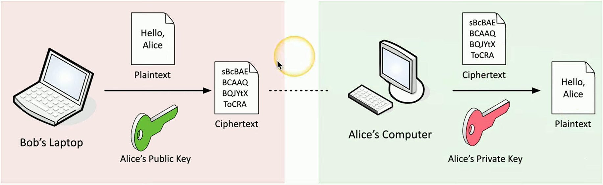
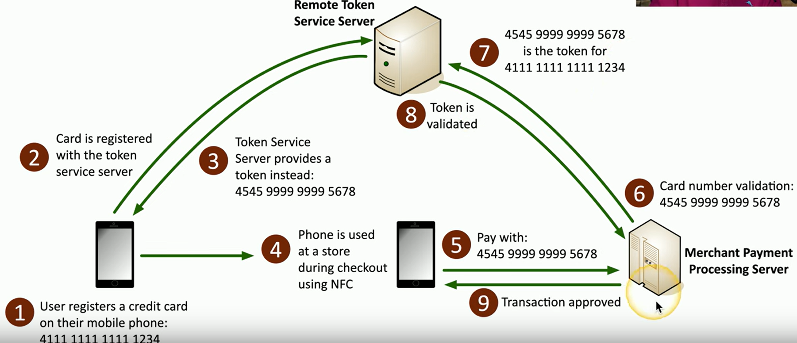
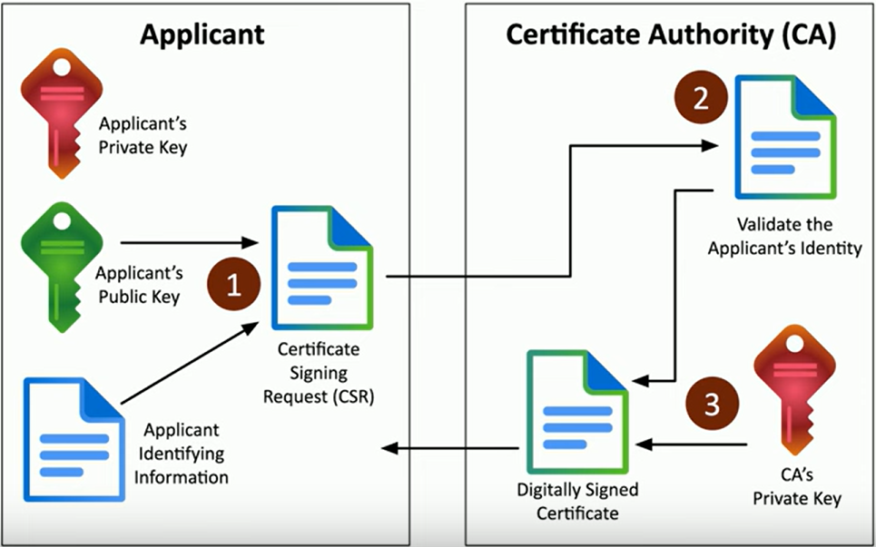

Full objective: "Explain the importance of using appropriate cryptographic
solutions."

### Public Key Infrastructure (PKI)
- Includes policies, procedures, hardware, software, people
- Creating, distributing, managing, storing, revoking digital certificates
- Also refers to the binding of public keys to people or devices, in association with certificate authority
- Symmetric encryption
	- A single, shared key
		- Used for the encryption and decryption of data
	- Secret key algorithm
	- Doesn't scale very well, but very fast
	- Often combined with asymmetric encryption
- Asymmetric encryption
	- Public key cryptography - two mathematically related keys
	- Private key and public key
		- Alice encrypts with Bob's public key
		- Bob decrypts with his private key
	- Cannot derive private key from public key
- The key pair
	- Key generation involves random and very large prime numbers
	- Everyone has public key, only individual has private key
- 
- Key escrow
	- Someone else holds your decryption keys (third-party)
		- May be within your organization
	- Business/government might need to decrypt partner data
	- Controversial, but can be legitimate business arrangement
### Encrypting Data
- Encrypting stored data
	- Protect data on stored data (data at rest)
	- Full-disk and partition/volume encryption - BitLocker, FileVault, etc.
	- File encryption - EFS, etc.
- Database encryption
	- Protecting and transmitting stored data
	- Transparent encryption - encrypt all database info with symmetric key
	- Record-level encryption - encrypt individual columns and use separate keys
- Transport encryption
	- Protect data traversing the network
	- Encrypting in the application (HTTPS, etc.)
	- VPN (Virtual Private Network)
		- Encrypts all data transmitted over the network
		- Client-based using SSL/TLS, site-to-site using IPSec
- Encryption algorithms
	- Many different options, both sides decide on algorithm
	- Differentiate in security, speed, complexity
	- (his graphic here for DES vs. AES is too vague/inaccurate)
- Cryptographic keys
	- To be secure, cryptographic solutions must be able to withstand the algorithm/process being revealed (only cracked if key is in possession)
	- Kerckhoff's principle - **the security of a cryptographic system shouldn't rely on the secrecy of the algorithm**
	- Key determines the output (encrypted data, hash value, etc.)
- Key lengths
	- Larger key = more secure
	- Symmetric encryption is commonly 128-, 192-, or 256-bit (AES)
	- Asymmetric encryption requires larger keys (3,072-bit or larger)
- Key stretching - make a key stronger by encrypting data multiple times
### Key Exchange
- Large and popular logistical challenge
- One example is "out-of-band" (not over network)
- In-band key exchange - over network, protect key with additional encryption
- Real-time encryption/decryption
	- Share a symmetric session key using asymmetric encryption (i.e. Diffie-Hellman)
### Encryption Technologies
- Trusted Platform Module (TPM)
	- **Cryptography hardware on a device,** specification for cryptographic functions
	- Cryptographic processor (RNG, keygen)
	- Persistent memory - keys burned during manufacturing
	- Versatile memory - storage keys and hardware config info (BitLocker, etc.)
	- Password protected
- Hardware Security Module (HSM)
	- Used in large environments - securely store thousands of keys
	- High-end cryptographic hardware
	- Cryptographic accelerators - offload high computing requirement
- Key management system
	- Centralized management system, on-premises or cloud-based
	- Separate keys from encrypted data
	- All key management from one console
- Keeping data private
	- Many, many different locations, wide attack vector
- Secure enclave - a protected area, hardware isolated from main processor
	- Provides extensive security features
		- Has own boot ROM, monitors bot process
		- Has TRNG, real-time memory encryption, and root keys
### Obfuscation
- The process of making something unclear, hiding info in plain sight
- Steganography - hiding information in images
	- Message is invisible but extractable
- Common steganography techniques
	- Network-based - embed messages in TCP packets
	- Use and image - embed message in the image itself
	- Invisible watermarks
	- Audio and video steganography
- Tokenization - replace sensitive data with a non-sensitive placeholder
	- Common with credit card processing - temporary token during payment
	- NOT encryption or hashing, original data and token not related
	- 
- Data masking
	- Data obfuscation - hide some of the original data - protects S/PII
	- May only be hidden from view (still in storage)
### Hashing and Digital Signatures
- Hashes - represent data as a short string of text
	- One-way function, impossible to recover data from hash
	- Used for integrity and digital signatures
- Collision
	- Hash functions may produce an identical hash from different input (i.e. MD5)
	- Modern hash functions (SHA256, etc.) do not have this problem
- Practical hashing
	- Verify a downloaded file by comparing hash with one provided on source
	- Storing passwords as a salted hash and use those during authentication
- Adding some salt - random data added to a password when hashing
	- Every user gets their own random salt, changes hash completely
	- Breaks rainbow tables (pre-computed hashes of common passwords)
- Digital signatures
	- Prove integrity, authentication, non-repudiation
	- Sign with private key, verify with public key
	- Any change in message will invalidate the signature
### Blockchain Technology
- Blockchain - a distributed ledger to keep track of transactions
	- Everyone maintains the ledger
- The blockchain process
	1. Transaction is requested
	2. Transaction is sent to every node in a decentralized network to be verified
	3. Verified transaction is added to a new block of data with other transactions
	4. Hash is calculated from previous blocks of transaction data and added to new block of verified transactions
	5. Block is added to end of Blockchain, updated to all nodes in the network
	6. If any blocks altered, all hashes recalculated, altered chain now rejected

### Certificates
- Digital certificates - a public key certificate
	- Binds a public key with a digital signature
	- Adds trust using Certificate Authority
	- Web of Trust adds other users for additional trust
	- Can also be built in to OS (Windows Domain services, etc.
- What's in a digital certificate?
	- X.509 - standard format
	- Details - serial number, version, algorithm, issuer, cert holder, public key, etc.
- Root of trust - an inherently trusted component to build trust
	- Hardware, software, firmware, etc.
	- HSM, Secure Enclave, CA, etc.
- Certificate Authorities
	- Digitally signs website certificates to provide real-time verification
	- Third-party trust for an unknown entity (website)
	- Hundreds of third-party CAs, built in to browser
- Certificate signing requests
	- Create key pair, send public key to CA to be signed
		- Certificate signing request (CSR)
	- CA validates request (confirm DNS emails and website ownership)
	- CA digitally signs cert and returns to applicant
	- 
- Private certificate authorities
	- You're your own CA, devices must trust internal CA
	- Needed for medium to large organizations with lots of web servers
	- Windows Certificate Services, OpenCA, etc.
- Self-signed certificates
	- Internal certificates don't need to be signed by a public CA
	- Build your own CA to issue your own certificates
	- Install CA certificate on all internal devices
- Wildcard certificates
	- Subject Alternative Name (SAN) - \*.domain.com
		- Extension to X.509
		- Allows certificate to support many domains
	- Wildcard domain
		- Certificates based on the name of the server
		- Applies to all server names in a domain
- Key revocation
	- Certificate Revocation List (CRL)
		- Maintained by CA
		- CVE-2014-0160 (Heartbleed) - OpenSSL flaw that required every web server certificate be replaced
- OCSP stapling - Online Certificate Status Protocol
	- Provides scalability for OCSP checks
	- CA responsible for responding to all client OCSP requests
	- Instead of this, have certificate holder very their own status
	- OCSP status is "stapled" into the SSL/TLS handshake
- Getting revocation details to the browser
	- OCSP - browser can check certificate revocation
	- Messages usually sent to OCSP responder via HTTP
		- More efficient than downloading a CRL
	- Not all browsers/apps support OCSP (most modern do)

Next: [2.1 Threat Actors and Motivations](https://github.com/lercc46/Messer-Sec-Plus-Notes/blob/main/2.0%20Threats%2C%20Vulnerabilities%2C%20and%20Mitigations/2.1%20Threat%20Actors%20and%20Motivations.md)
