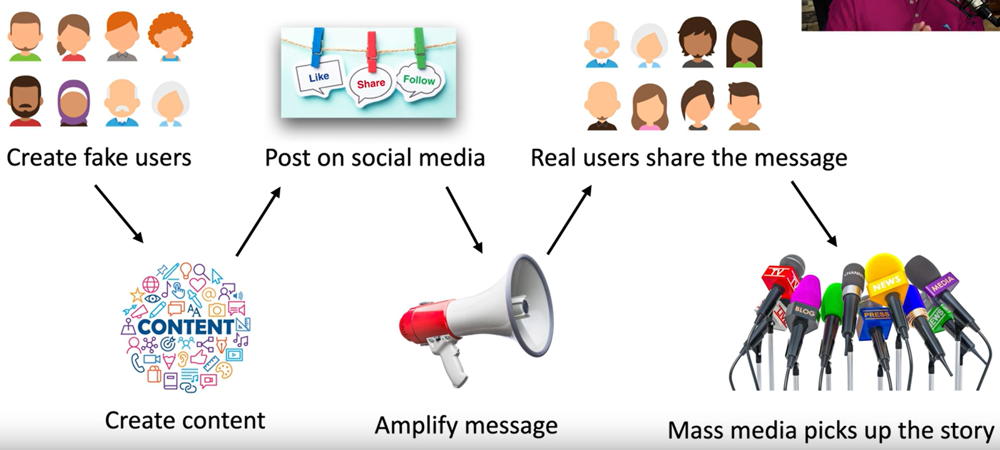

Full objective: "Explain common threat vectors and attack surfaces."

### Common Threat Vectors
- A method used by the attacker to gain access to or infect the target
	- Also called "attack vectors"
- A lot of work goes into finding them, security professionals spend lots of time protecting existing vectors and finding new vectors
- Message-based vectors
	- One of the biggest and most successful vectors
	- Email, SMS (malicious links/attachments)
	- Phishing attacks
	- Deliver malware via attachment
	- Social engineering attacks (scams)
- Image-based vectors
	- Easy to identify text-based, harder to identify threat in an image
	- Some image formats can be a threat (SVG, described in XML)
	- HTML injection, JavaScript attack code
	- Browsers must provide input validation
- File-based vectors
	- More than just executables
	- Adobe PDF, file format containing other objects
	- ZIP/RAR/any compression, obfuscates attack
	- Microsoft Office (macros, add-in files)
- Voice call vectors
	- Vishing - phone phishing
	- Spam over IP - large-scale phone calls over IP
	- War dialing - finding unpublished phone numbers to gain access
	- Call tampering - disrupting voice calls (DoS)
- Removable device vectors
	- Get around firewall - malicious software on a USB stick
	- Infecting air-gapped networks, industrial systems, high-security services
	- USB devices can act as keyboards
	- Data exfiltration - terabytes of data can walk out the door with zero bandwidth
- Vulnerable software vectors
	- Client-based - infected executable with known (or unknown) vulnerabilities
	- Agentless - no installed executable
		- Compromised software on server would affect all users
- Unsupported system vectors
	- Patching must be done, but some systems are too old to be patched
	- A single unsupported system could be an entry for attack
- Unsecure network vectors
	- Network connects everything, view all unencrypted data
	- Wireless - outdated protocols and open/rogue networks
	- Wired - unsecure interfaces, must enable 802.1X
	- Bluetooth - reconnaissance, implementation vulnerabilities
- Open service ports
	- Most network-based services connect over a TCP or UDP port (open)
	- Every open port is an opportunity
	- Every application has their own open port
	- Firewall rules, limit open port rules
- Default credentials
	- Most devices have defaults, absolutely MUST change them immediately
- Supply chain vectors
	- Tamper with underlying infrastructure or manufacturing process
	- Managed service providers - gives access to many customer networks
	- Gain access to a network using a vendor - 2013 Target credit card breach
	- Suppliers - counterfeit networking equipment
		- Install backdoors, substandard performance and availability
		- 2020 - fake Cisco Catalyst switches
### Phishing
- Social engineering with a touch of spoofing (email, SMS, etc.)
- Check URL domains and attachments!
- Usually there's something not quite right
- Business email compromise
	- Attackers take advantage of the internal network trust
	- Spoofed email address, one or two characters changed
	- Financial fraud, bank information or wire transfer details
	- Links or attachments with malware
- Tricks and misdirection
	- Typosquatting - URL hijacking (similar URLs)
	- Pretexting - lying to get information, creating a character
- Phishing with different bait
	- Vishing (voice phishing) - spoofing caller ID
		- Fake security checks or bank updates 
	- Smishing (SMS phising)
		- Commonly a shipment tracking scam (USPS, etc.)
- https://reddit.com/r/Scams
### Impersonation
- Attackers pretend to be someone they aren't
- Use some details from reconnaissance, aids in trust
	- Attack victim as someone higher in rank
	- Throw around technical or personal details
- Eliciting information
	- Extracting information, often seen in vishing, well documented
- Identity fraud
	- Credit card fraud, your name and credit information
	- Bank fraud, loan fraud, government benefits fraud, tax fraud
- Protect against impersonation
	- Never volunteer information
	- Don't disclose personal details
	- Always verify before revealing info
### Watering Hole Attacks
- Attacker poisons the "watering hole" and waits for you to visit
- Executing
	- Determine the frequented website/service
	- Infect one of these third-party sites
	- Infect all visitors
- Polish Financial supervision Authority, National Banking and Stock Commission of Mexico, State-owned bank in Uruguay (January 2017)
	- Visiting site would download malicious JS files, only to IPs matching targeted financial institutions
- Watching the watering hole
	- Security-in-depth (layered defense, even when internal access granted)
	- Firewalls and IPS
	- Anti-virus/malware signature updates
### Other Social Engineering Attacks
- Misinformation/disinformation
	- Create confusion and division by disseminating factually incorrect information
	- Influence campaigns (political and social issues)
	- Nation-state actors
	- Enabled through social media and advertising
- The misinformation process 
- Brand impersonation - pretend to be a well-known brand
	- Create tens of thousands of impersonated sites to get into the Google index
	- Malware infection is almost guaranteed

Next: [2.3 Vulnerabilities](https://github.com/lercc46/Messer-Sec-Plus-Notes/blob/main/2.0%20Threats%2C%20Vulnerabilities%2C%20and%20Mitigations/2.3%20Vulnerabilities.md)
