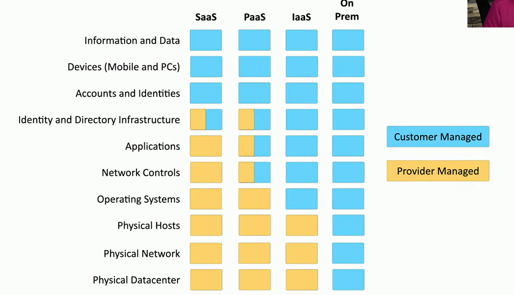
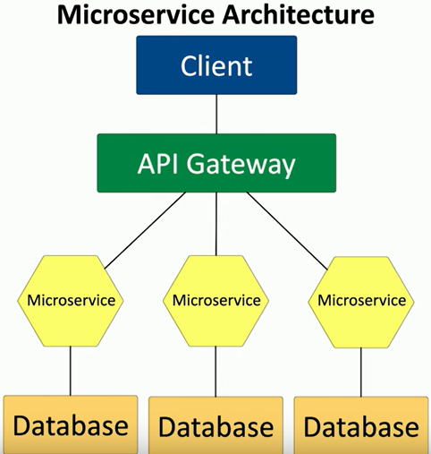
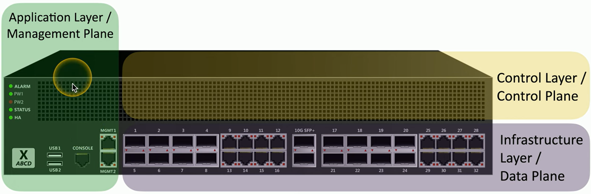
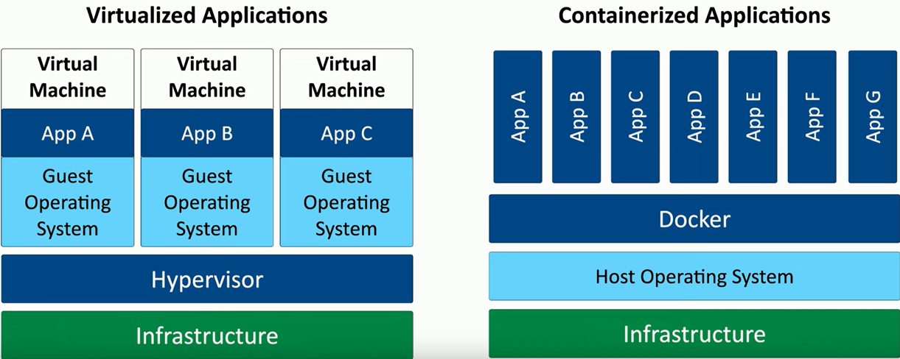

Full objective: "Compare and contrast security implications of different
architecture models."

### Cloud Infrastructures
- Cloud responsibility matrix
	- IaaS, PaaS, SaaS... who is responsible for security? Should be well documented
	- 
- Hybrid considerations
	- Hybrid cloud - more than one public or private cloud
	- Network protection mismatches - auth, firewall, server settings
	- Different security monitoring
	- Data leakage
- Third-party vendors in the cloud
	- You, the cloud provider, and third parties
	- Ongoing vendor risk assessments to maintain posture of third-parties
	- Constant monitoring
- Infrastructure as code
	- Describe an infrastructure (servers, network, and apps) as code
	- Modify infrastructure and create versions
	- Use the code as a template to build more instances
	- Very important concept for cloud computing
- Serverless architecture
	- Function as a Service (FaaS)
		- Apps separated into functions
		- Remove OS from the equation
	- Dev still creates the server-side logic
	- May be event-triggered
	- Managed by third-party
- Microservices and APIs
	- Old: monolithic applications running locally, hard to manage
	- New: Application Programming Interfaces, "glue" for the microservices, scalable
	- 
### Network Infrastructure Concepts
- Physical isolation - devices are physically separate (air gap)
	- Must be connected to provide communication
	- Different servers on different racks (separate types, customers, etc.)
	- Physical segmentation
- Local segmentation with VLANs
	- Virtual Local Area Networks, same effect
	- Separate logically instead of physically, cannot communicate between without a Layer 3 device (router)
- SDN (Software Defined Networking)
	- Networking devices have different functional planes of operation
		- Data, control, and management
	- Split these into separate logical units (devices)
	- Infrastructure/Data plane - network frames and packets
	- Control plane - manages actions of data plane (routing, etc.)
	- Application/Management Plane - configure and manage devices
	- 
	- Has major new cloud applications, completely logical networking
### Other Infrastructure Concepts
- Cloud vs. on-premise
	- Cloud-based - centralized and cheaper
	- On-premises - security burden on client, but complete control
	- All in all, attackers want your data, they don't care where it is!
- On-premises security
	- Pros
		- Customize security posture
		- On-site IT team can easily manage
		- Local team maintains uptime and ability
	- Cons
		- Security updates may take time
- Centralized vs. decentralized
	- Most are physically decentralized
		- Difficult to manage
	- Centralized approach can consolidate status, logs, maintenance
		- Not perfect, single point of failure
- Virtualization
	- Run many different operating systems on the same hardware
	- Each app instance has its own operating system, adds overhead
	- Relatively expensive
- App containerization
	- Container - contains everything (code, dependencies), standardized unit of software
	- Isolated process in a sandbox, efficient
	- Lightweight, uses host kernel
	- Secure separation between apps
	- Popular software is Docker
	- 
- IoT (Internet of Things)
	- Sensors, monitors, cameras, smart hubs, watches, phones, thermostats
	- Provide automation and flexibility but lots of security flaws
- SCADA / ICS
	- Supervisory Control and Data Acquisition System
		- Large-scale, multi-site Industrial Control Systems (ICS)
	- PC manages equipment
	- Distributed control systems - real-time info, sys control
	- Requires extensive segmentation
- RTOS (Real-Time Operating System)
	- OS with deterministic processing schedule - industrial, military, automotive
		- No time to wait for other processes
	- Extremely sensitive to security issues
- Embedded systems
	- Hardware and software specifically designed for a function / larger system
	- Traffic light controllers, digital watches, medical imaging systems
- High availability
	- Redundancy - handy, not always available
	- HA (high availability) - always on, always available
	- May include different components working concurrently
	- Almost always higher cost
### Infrastructure Considerations
- Availability
	- Uptime - access data, complete transactions; foundation of IT security
- Resilience
	- How to maintain availability and recover
	- MTTR (Mean Time to Repair)
- Cost
	- How much money is required
	- Ongoing maintenance and taxes, recurring cost
- Responsiveness
	- Request info, how quickly is request satisfied
	- Important for interactive applications
- Scalability
	- How can we increase/decrease capacity
	- Elasticity of application/infrastructure
- Ease of deployment
	- Many moving parts, how easy can it be employed
- Risk transference
	- Transfer risk to a third-party
	- Cybersecurity insurance, attacks/downtime covered
	- Recover internal losses, protect against legal issues
- Ease of recovery
	- Something will always go wrong eventually
	- Malware infection - reload OS (hard, time consuming), reload from backup (better, faster)
- Patch availability
	- Software (mostly) isn't static
	- Must be up to date and update regularly
	- Inability to patch - embedded systems, etc.; not designed for end-user updates
		- Might require additional security controls
- Power
	- Foundational, can require extensive thought and engineering
	- Overall requirements (data center vs. office vs. home)
	- Primary power and backup power (UPS, generator)
- Compute
	- Application's heavy lifting, the compute engine
	- Can be single or multiple processors

Next: [3.2 Infrastructure Security Principles](https://github.com/lercc46/Messer-Sec-Plus-Notes/blob/main/3.0%20Security%20Architecture/3.2%20Infrastructure%20Security%20Principles.md)
