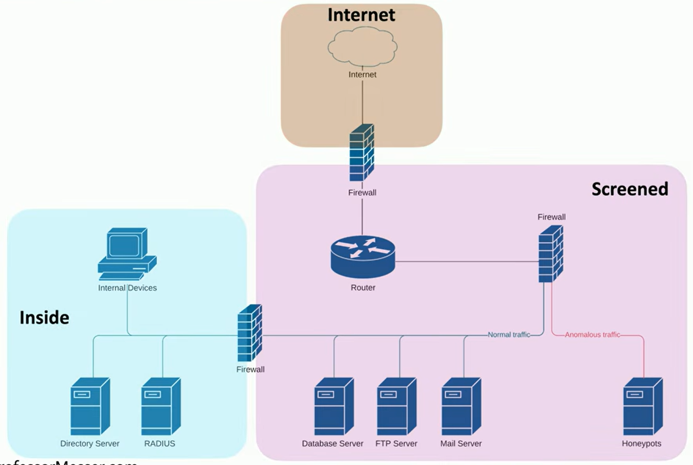
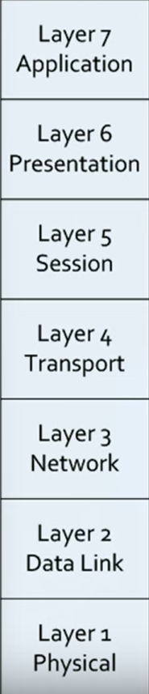
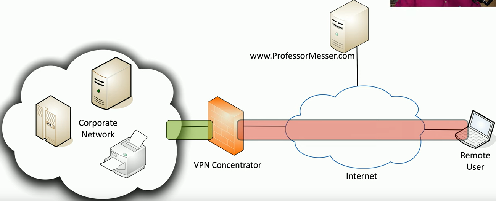
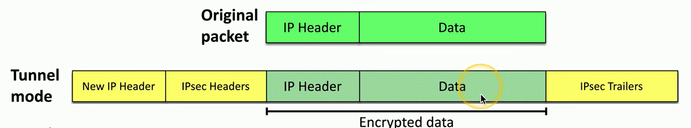
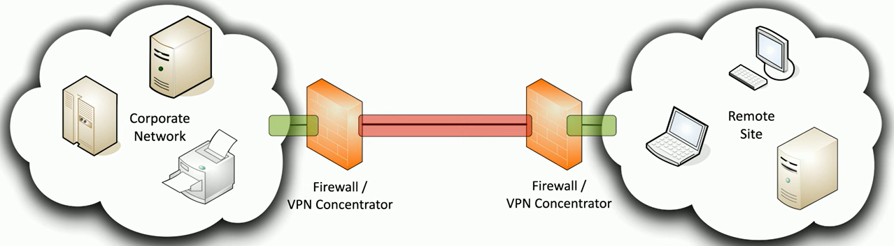
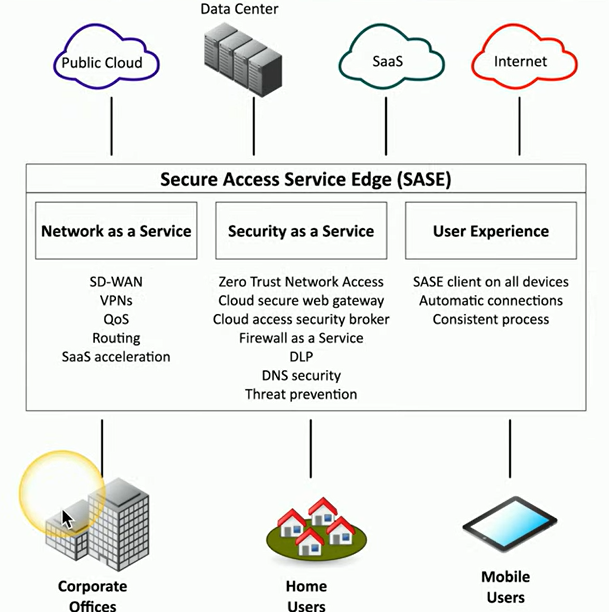

Full objective: "Given a scenario, apply security principles to secure enterprise
infrastructure."

### Secure Infrastructure
- Device placement
	- Firewalls - separate trusted from untrusted
	- Other devices may require their own measures (honeypots, load balancers, etc.)
- Security zones
	- Separate by use and access
	- Each area associated with a zone - trusted/untrusted, internal/external
	- Simplifies security policies, traffic from some zones to others allowed, some not\\
	- 
- Attack surface
	- Any opening that may be on the network
		- Code, ports, auth process, human error
	- Want to minimize - audit, block ports, monitor traffic
- Connectivity
	- Every connected device contributes to security
	- Secure physical and logical connections
	- Only as strong as the weakest link
	- Application/network-level encryption
### Intrusion Prevention
- IPS - watch network traffic, detect common/uncommon intrusions, enable preventative measures
	- IDS similar, but only alarms - does not stop traffic
- Failure modes
	- 100% uptime is a nice though, but not realistic - we need to think about what will happen during the downtime
	- Fail-open - when a system fails, data continues to flow
	- Fail-close - data stops flowing
- Device connections
	- Active monitoring - I(D/P)S connected inline, data blocked in real-time, IPS active
		- Could be too aggressive, in link so it can cause downtime
	- Passive monitoring - through switch (taps traffic), data not blocked, common
### Network Appliances
- Jump server - access secure network zones
	- Highly secured device, SSH/Tunnel/VPN for access, significant security concern
- Proxies - sit between users and external network
	- Receives requests and sends on proxy's behalf
	- Caching, access control, URL filtering
	- Explicit proxy - apps know how to use and is apparent
	- Transparent proxy - users may not know it's even happening
	- Application proxies
		- NAT - network level
		- Application proxy - ... application level, understands app
			- May only know one app, like HTTP proxy
			- Many are multipurpose, handle several protocols/apps
	- Forward proxy - "internal proxy", used to protect and control user access to the internet
	- Reverse proxy - inbound traffic from internet to your internal service (server)
	- Open proxy - third-party, uncontrolled proxy
		- Can be a significant concern, can circumvent existing controls
		- Most times are blocked
- Load balancers - distribute load to multiple services for seamless end-user experience
	- Active/active - all servers active, all being used actively
		- Configurable load across servers
		- TCP offload, SSL offload, caching, prioritization, content switching
	- Active/passive - all on, some inactive
		- If active server fails, passive takes its place (stand-by)
- Sensors and collectors
	- Aggregate information from network devices - built-in sensors, etc.
	- Sensors - IPS, firewall logs, auth logs
	- Collectors - proprietary consoles, SIEM consoles
### Port Security
- Individual services and resources
- Extensible Authentication Protocol (EAP) - an authentication framework
	- Manufacturers build their own methods
	- EAP integrates with 802.1X, no access until auth succeeds
- IEEE 802.1X - port-based Network Access Control (NAC), ^^^
	- Used in conjunction with auth database (LDAP, Kerberos, etc.)
	- Supplicant - client, authenticator - access provider, auth server - validator
	- Authenticator sits in the middle and forwards messages
### Firewall Types 
- The universal security control, control flow of network traffic, inbound/outbound
- Network-based firewalls - filter traffic by port number or application
	- Most are layer 3 devices (routers)
	- NAT functionality, encrypt traffic (VPN), dynamic routing communication
	- 
- UTM (Unified Threat Management) / 
	- All-in-one security appliance, web security gateway
	- URL filter, content inspection, malware inspection, spam filter, router, switch, firewall, IDS/IPS, bandwidth shaper, VPN endpoint
	- Only operate at layer 4, drawback on performance and single point of failure
- Next-generation firewall (NGFW)
	- OSI application layer (layer 7), all data in every packet
	- Requires some advanced decodes
	- Doesn't just rely on port number
	- Can have an IPS, content filtering, etc.
- Web application firewall (WAF)
	- Not like a normal firewall, rules for HTTP/S conversations
	- Allow or deny based on expected input, identify SQL injections
	- Major focus of [PCI DSS](https://en.wikipedia.org/wiki/Payment_Card_Industry_Data_Security_Standard)
### Secure Communication
- VPNs (Virtual Private Networks) - encrypted data traversing public network
	- Concentrator - en/decryption access device, integrated into firewall
	- Many options (cryptography, etc.), used with client software
	- 
- Encrypted tunnel
	- Add new headers and tailers, "tunneling", decrypt on the other side
	- 
- SSL/TLS VPN (Secure Sockets Layer VPN)
	- Uses 443, almost no firewall issues
	- No big VPN clients
	- Authenticate users, can be run from a browser
	- On-demand access from a remote device
- Site-to-site IPsec VPN
	- Always (or almost always) on
	- Firewalls act as VPN concentrators
	- 
- SD-WAN (Software Defined WAN)
	- WAN built for the cloud
	- Cloud-based apps communicate directly from the cloud, no centralization needed
- Secure Access Service Edge (SASE)
	- Update secure access for cloud services, securely connect from different locations
	- Next generation VPN, security technologies in the cloud
	- 
- Selection of effective controls
	- VPN - SSL/TLS for user access, IPsec for site-to-site
	- SD-WAN - manage network connectivity to cloud, not great for security
	- SASE - complete network and security solution, fixes ^^^

Next: [3.3 Data Protection](https://github.com/lercc46/Messer-Sec-Plus-Notes/blob/main/3.0%20Security%20Architecture/3.3%20Data%20Protection.md)
