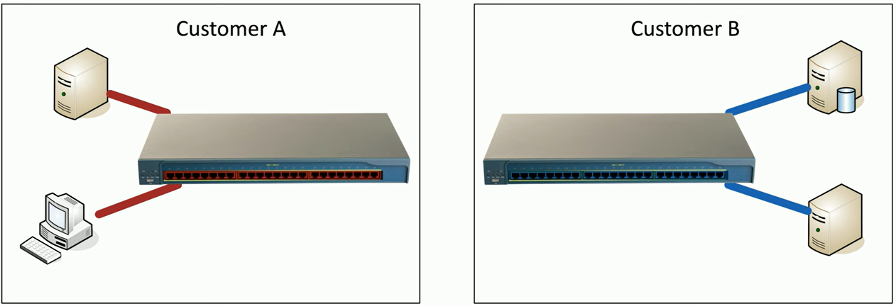
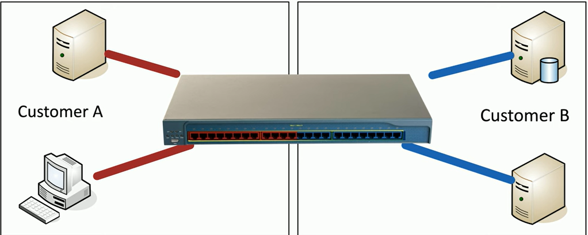

Full objective: "Explain various activities associated with vulnerability
management."

### Vulnerability Scanning
- Minimally invasive, scan for potential of attack
- Port scan, identify systems, test from outside and inside network, gather info
- Static code analyzers (Static Application Security Testing) - prev.
- Dynamic analysis (fuzzing) - send random input to application
	- Look for something out of the ordinary
	- First: 1988 class project at Univ. Wisconsin, "The Fuzz Generator"
- Fuzzing engines and frameworks
	- Very time and resource heavy
	- Carnegie Mellon CERT Basic Fuzzing Framework (BFF)
- Package monitoring
	- Some apps distributed in a package (especially in Linux)
	- Confirm the package is legit - trusted source, no malware, etc.
	- Confirm a safe package before deployment
### Threat Intelligence
- Always keep up to date with threats and threat actors
- Make security decisions based on this intelligence
- Open-source intelligence (OSINT)
	- Publicly available sources on the internet - social media, forums, etc.
	- Government data - public hearings, reports, websites, etc.
	- Commercial data - maps, financial reports, databases, etc.
- Proprietary / third-party intelligence
	- Someone else already compiled threat info, you buy it
	- Threat intelligence services - analytics, correlations, threat monitoring
- Information-sharing organizations
	- Public threat intelligence - often classified info, compiled publicly
	- Private threat intelligence - private companies with extensive resources, additional details
	- Cyber Threat Alliance (CTA) - org. of groups that share threat intelligence
		- Members upload specifically formatted threat intelligence
		- CTA scores and validates across other submissions
- Dark web intelligence
	- Dark web - overlay networks that use the internet, requires specific software to access
	- Hacking groups and services - extract activities, tools, techniques, etc.
	- Monitor dark web forums for intelligence
### Penetration Testing
- Simulate an attack on your own systems - like vuln scanning, but you exploit the vulnerabilities
- Often for compliance purposes, done by a third-party
- [NIST Technical Guide to Information Security Testing and Assessment](https://csrc.nist.gov/pubs/sp/800/115/final)
- Rules of engagement - defines purpose and scope of testing
	- Type of testing and schedule - on-site vs remote, internal vs external, within or outside working hours, etc.
	- Rules - IP ranges, emergency contacts, sensitive info handling, in- and out-of-scope devices/applications
- Exploiting vulnerabilities - try to break into the system
	- Be careful, can cause DoS or loss of data
	- Try different vulnerabilities - password brute-force, social engineering, database (SQL) injections, buffer overflows, privilege escalation, etc.
- The process
	- Initial exploitation - get into the network
	- Lateral movement - system to system
	- Persistence - make sure you can stay or get a way back in (backdoor, etc.)
	- The pivot - gain access to systems normally not accessible
		- Use vulnerable system as proxy or relay
- Responsible disclosure program (like CVE db)
	- It takes time to fix a vulnerability - software changes, testing, deployment, etc.
		- May be a while between disclosure and patching!
	- Bug bounty programs - reward for discovering vulnerabilities
	- Controlled information release
		- Researcher reports vulnerability
		- Manufacturer creates a fix
		- Vulnerability announced publicly
### Analyzing Vulnerabilities
- Dealing with false information\
	- False positives - vuln identifies that doesn't exist
		- Different than low-severity vuln - real but not highest priority
	- False negative - vuln exist but goes undetected
		- Much worse!
	- Update to the latest signatures, work with vuln detection manufacturer
- Prioritizing vulnerabilities - difficult
	- Refer to public disclosures and vulnerability databases
- Common Vulnerability Scoring System (CVSS) - quantitative scoring of a vulnerability, 0-10
	- Scoring standards change over time, different from CVSS 2.0 to 3.x
- CVE
	- Vulns can be cross-referenced
	- [Common Vulnerabilities and Exposures (CVE)](https://www.cve.org)
	- [National Vulnerability Database](https://nvd.nist.gov/) - synced with CVE list
	- [Microsoft Security Bulletins](https://learn.microsoft.com/en-us/security-updates/securitybulletins/securitybulletins)
	- Some vulns cannot be definitively identifies, check manually
- Vulnerability classification
	- Application scans - desktop/mobile apps
	- Web application scans - software on a web server
	- Network scans - misconfigured firewalls, open ports, vulnerable devices
- Exposure factor - loss of value or business activity if the vuln is exploited
	- Small DDoS may limit access to a service - 50%
	- Buffer overflow may completely disable a service - 100%
	- Consideration when prioritizing
- Environmental variables - what type of environment is associated with this vulnerability?
	- Prioritization and patching frequency - isolated test lab vs database server in public cloud, etc.
	- Every environment is different!
		- Number and types of users (in- vs. external)
		- Revenue generating application
		- Potential for exploit
- Industry/organizational impact - some exploits have significant consequences
	- Tallahassee Memorial HealthCare - Feb 2023 - ransomware
		- Diverted emergency cases, surgeries cancelled
	- Power utilities - SLC, Utah and LA County, California - March 2019 - DDoS from known unpatched vulnerability
- Risk tolerance - amount of risk acceptable to an organization
	- Impractical to remove all risk
	- Timing of security patches - patching immediately doesn't allow for testing
		- Testing takes time, but you're vulnerable
		- Middle ground, may change based on security
### Vulnerability Remediation
- Patching - most common mitigation technique
	- Scheduled vuln/patch notices - normal, monthly/quarterly
	- Unscheduled patches - zero days, often urgent
	- Ongoing process, easy way to prevent most exploits
- Insurance - cybersecurity insurance coverage
	- Lost revenue, data recovery, phishing, privacy lawsuits
	- Doesn't cover everything - intentional acts, funds transfers, etc.
	- Ransomware has increased popularity of this
- Segmentation - limit the scope of an exploit by separating devices
	- Breach would have limited scope
	- Cant patch? Disconnect from the world, air-gap
	- Use internal NGFWs - block unwanted/unnecessary traffic between VLANs
		- Identify malicious traffic on the inside
	- Physical segmentation - separate switches, air-gapped 
	- Logical segmentation - separate VLANs, cannot communicate b/w without layer 3 device / router 
- Compensating controls
	- Optimal security methods may not be available, compensate in other ways
	- Disable problematic service, revoke app access, limit external access, modify internal controls and firewalls, etc.
	- Provide coverage until a patch is deployed
- Exceptions and exemptions
	- Removing vuln is optimal, but not everything can be patched
	- Provide service but also protect data and systems
	- Not all vulns share same severity - local login, physical access, etc.
	- Exception may be an option, formally approved for systems and apps
- Validation of remediation - did the patch work?
	- Rescanning - vuln scan to verify
	- Audit - check systems to ensure
	- Verification - manually confirm security
- Reporting
	- Ongoing checks required but difficult without automation
	- Continuous reporting solves this
		- Number of identified vulnerabilities
		- Systems patched vs. unpatched
		- New threat notifications
		- Errors, exceptions, exemptions

Next: [[4.4 Monitoring]]